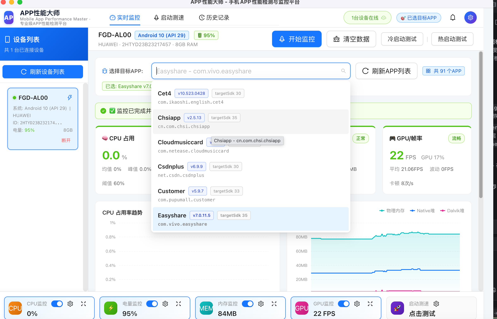

# 🚀 APP性能大师 (Mobile App Performance Master)

> 一款 **Windows / macOS 跨平台桌面工具**，专业级 Android APP 全维度性能检测与监控平台。USB/Wi-Fi 连接手机后实时采集 CPU、电量、内存、GPU、FPS、温度等毫秒级数据，支持冷/热启动自动测速、阈值超限告警、**设备断开自动停止并保存数据**、一键导出 PDF/PPT/Excel 彩色分级报告，面向 APP 测试工程师、开发与性能优化同学。

---

## 🖥️ 界面概览



> 🔼 上图：**实时监控** 主页面（默认页），各区域对应说明：
>
> | 编号 | 区域 | 说明 |
> |------|------|------|
> | ① | **顶部导航** | 三个核心 Tab：实时监控 / 启动测速 / 历史记录；右上角设备在线数 + 告警铃铛 + 用户设置 |
> | ② | **左侧设备列表** | 已连接 ADB 的设备卡片（型号/Android版本/电量/内存），选中后主页面激活；点击【刷新设备列表】重新扫描 |
> | ③ | **设备/APP 信息栏** | 当前选中设备详情（型号/序列号/内存/电量）；监控过程中显示内存实时剩余、阈值告警等 |
> | ④ | **目标 APP 选择器** | 搜索框支持中文名称/包名；下拉显示 APP名称 + 版本号 + targetSdk；【刷新APP列表】+「共91个APP」统计；**⬇️ 为空时点一键诊断** |
> | ⑤ | **控制按钮** | 开始监控 / 清空数据 / 冷启动测试 / 热启动测试；⚠️ 未选 APP 时按钮为灰色禁用态 |
> | ⑥ | **4张实时图表** | CPU占用、内存占用、电量温度、GPU/FPS + 帧率波动曲线图；⚠️ **滚动条默认常驻显示**（Mac下不用滚动也能看到滑块） |
> | ⑦ | **空状态提示** | 未选 APP 时显示：请先选择目标 APP，点击右上角「开始监控」 |
> | ⑧ | **底部指标栏** | CPU/电量/内存/GPU 4个独立开关卡片（眼睛=显示隐藏、叉=清除告警、齿轮=自定义阈值）；右侧「点击测试」快捷跳转启动测速 |
> | ⑨ | **实时数值卡** | 每张图表右上角状态标签（正常🟢/告警🔴）+ 当前数值/均值/峰值/最低值 |

---

## ✨ 核心功能

### 一期必做功能（已全部落地）
- ✅ **设备扫描与管理** - 每 5 秒自动 `adb devices` 扫描，展示设备型号、系统版本、电量、内存；支持无线 ADB、USB 热插拔
- ✅ **CPU 实时监控** - APP 单核/整机 CPU 占用率、峰值、均值、ECharts 实时曲线
- ✅ **电量监控** - 当前电量、温度、单位时间耗电、累计耗电估算
- ✅ **内存监控** - PSS 物理内存 / Native & Dalvik 堆 / 峰值 / 剩余内存
- ✅ **GPU / 帧率监控** - GPU 占用率、FPS、帧率波动、1 秒卡顿次数统计
- ✅ **目标 APP 列表** - `pm list packages -3` + fallback 全量包过滤，并发 4 条 `dumpsys package` 拉取 APP 名称/版本
- ✅ **一键诊断（APP 为空/获取失败专用）** - 直接执行 4 条原始 ADB 命令输出 + 智能建议（权限/ROM 限制/并发限流）
- ✅ **冷启动测速** - 卸载 → 静默安装 APK → 首次启动，记录安装/启动/首帧耗时
- ✅ **热启动测速** - am force-stop 清后台 → 再次拉起，记录总耗时/唤醒/首屏加载
- ✅ **实时数据可视化** - 数字卡片 + ECharts 趋势曲线（鼠标悬停看具体数值）
- ✅ **自定义阈值** - 6 大类指标 + 内置行业默认值；底部齿轮随时修改；超限红色告警
- ✅ **实时超限告警** - 顶部铃铛红点 + AntD message Toast + 告警抽屉汇总
- ✅ **📌 设备断开自动停止（双保险机制）** - 连续 3 次采集失败或 ADB 列表中设备消失 → 自动 `stopMonitoring` → `saveTestRecord()` 落盘 → 前端 Toast 提示并切回"已完成"状态，已采集数据绝不丢失
- ✅ **📌 历史测试记录** - 每次「停止并保存」/「自动停止」均生成一条 JSON 记录，【历史记录】Tab 可查看、搜索、回看、导出报告
- ✅ **📌 默认常驻滚动条** - Mac/Electron 下不用滚动鼠标也能看到深灰 12px 宽滚动条（`overflow-y: scroll` + `:window-inactive` 失焦不变淡）
- ✅ **模拟数据模式** - 无 ADB 环境下自动切换，内置 3 台模拟设备 + 12 个常见 APP + 随机性能数据演示全流程

### 稳定性 & 跨端修复（v1.0.0 交付）
- ✅ **开发端口探测 Promise 异常兜底** - `probeDevPort` 函数 3 层 try-catch：外层兜底返回 3000、环境变量端口合法性校验、单个 HTTP 探测 Promise 内部 catch，杜绝单个端口探测异常导致整段失败
- ✅ **PDF 导出中文显示支持** - 弃用 jsPDF 英文字体方案，改用 Electron `BrowserWindow + printToPDF`，HTML 模板用系统中文字体（宋/黑/苹方）渲染，支持全中文 + 红黄绿三色分级表格
- ✅ **打包后骨架屏卡死终极修复** - `isDev` 双保险判断 + scripts 显式 `cross-env NODE_ENV=production`，生产模式 `index.html` 注入 `<script src="renderer.js">` 为相对路径，完美兼容 `file://` 协议；20 秒超时自动显示红色崩溃诊断面板
- ✅ **preload 三层兜底挂载** - `contextBridge.exposeInMainWorld` → `Object.defineProperty` → 直接赋值 `window.electronApi`，所有 IPC 调用 `.catch()` 返回降级值，极端异常场景也不抛未处理 Promise
- ✅ **React 渲染 try-catch** - `ReactDOM.createRoot().render()` 外层 try-catch，捕获异常后直接在 `#root` 内渲染红色崩溃面板（含堆栈 + 日志路径），不会永远停骨架屏

## 🏗️ 技术栈

| 层级 | 技术选型 | 用途 |
|------|---------|------|
| **桌面框架** | Electron 28 | 跨平台（Windows10/11 + macOS 10.15+） |
| **主进程** | Node.js 18 + TypeScript | ADB 命令封装、监控采集循环、报告生成、IPC 安全通信 |
| **渲染层** | React 18 + TypeScript | Ant Design 5 全中文界面 |
| **状态管理** | Zustand 4 | 轻量全局 store（devices/monitorStatus/阈值） |
| **图表** | Apache ECharts 5 | 趋势曲线 + 实时数据点 |
| **持久化** | JSON + `app.getPath('userData')` | 测试记录/阈值配置本地保存（英文路径，避免 macOS 沙箱拦截中文目录） |
| **构建** | Webpack 5 双进程 | 主进程 `webpack.main.config.js` + 渲染进程 `webpack.renderer.config.js` |
| **开发** | concurrently + wait-on | `npm run dev` 同时起 webpack-dev-server + 监听主进程 + 自动拉起 Electron |

---

## 📁 项目目录结构

```
App_perfomance/                     # 根目录（仓库名，实际 app 显示名 = APP性能大师）
├── package.json                    # 依赖 & npm scripts（dev/build/start）
├── tsconfig.json
├── webpack.main.config.js          # Electron 主进程打包
├── webpack.renderer.config.js      # React 渲染进程打包 (target: web，兼容 contextIsolation:true)
│
├── screenshots/                    # 【截图目录】README 用的图片放这里（主界面.png 等）
│
├── resources/
│   └── icons/app-icon.svg          # 应用图标（APP性能大师）
│
└── src/
    ├── shared/                             # 主/渲染进程共享 TypeScript 类型与常量
    │   └── types.ts                        # DeviceInfo/AppInfo/MonitorConfig + IpcChannel 枚举
    │
    ├── main/                               # Electron 主进程（Node.js，有完整 fs/adb 权限）
    │   ├── index.ts                        # 窗口生命周期 + IPC 通道注册 + 监控回调广播
    │   ├── preload.ts                      # contextBridge 暴露安全 API（window.electronApi.*）
    │   └── services/
    │       ├── AdbManager.ts               # ADB 命令封装：scanDevices / getInstalledApps / debugAppList / dumpsys 采集
    │       ├── MonitorService.ts           # 监控 session 调度、采集循环、consecutiveFailures 连续 3 次失败自动停止
    │       ├── StorageService.ts           # saveTestRecord / loadThresholds / 本地 JSON 读写
    │       └── ReportExportService.ts      # Excel/PDF/PPT 三色分级报告生成
    │
    └── renderer/                           # Electron 渲染进程（React + Chromium）
        ├── index.html
        ├── index.tsx                       # ReactDOM + AntD ConfigProvider 入口
        ├── App.tsx                         # 根组件：顶部 Header Tab + 左侧 DevicePanel + 右侧 Content + 底部 MetricsBar + onDevicesUpdated 订阅
        ├── types/global.d.ts               # window.electronApi 完整类型声明
        ├── styles/index.less               # 全局布局：flex 高度链路（height:0 / min-height:0 兜底） + 12px 常显滚动条样式
        ├── store/appStore.ts               # Zustand store
        └── components/
            ├── DevicePanel.tsx             # 左侧：设备列表 + 刷新按钮
            ├── DashboardContent.tsx        # 实时监控页：APP 选择器 + 4 张图表 + 控制按钮 + 双保险自动停止 useEffect
            ├── MetricsBar.tsx              # 底部 4 指标开关卡片 + 阈值弹窗
            ├── TrendChart.tsx              # ECharts 曲线图通用封装
            ├── StartTestPage.tsx           # 启动测速页（冷启动/热启动 Tabs）
            ├── HistoryPage.tsx             # 历史记录列表 + 详情回看
            └── AlertsPanel.tsx             # 超限告警抽屉面板
```

---

## � 开箱即用安装包（免源码，推荐普通用户使用）

已在 `release/` 目录下预构建好 **macOS（Apple Silicon M 系列）+ Windows 64bit** 安装包，**不需要 Node.js / npm / Android SDK，双击即装即用**：

| 平台 | 格式 | 文件名 | 说明 |
|------|------|--------|------|
| **macOS (Apple Silicon / M1/M2/M3/M4)** | DMG（推荐安装版） | `APP-Performance-Master-Mac-1.0.0-arm64.dmg` | 双击 DMG → 拖「APP性能大师」到 /Applications → 从 Launchpad 启动 |
| | ZIP（免安装绿色版） | `APP-Performance-Master-Mac-1.0.0-arm64.zip` | 解压后直接拖到任何目录即可运行（适合没有管理员权限的场景） |
| **Windows 10/11 x64** | NSIS 安装程序 | `APP-Performance-Master-Windows-Setup-1.0.0-x64.exe` | 双击 EXE → 选择安装目录 → 桌面/开始菜单自动创建快捷方式 |
| | Portable（便携版） | `APP-Performance-Master-Windows-1.0.0-x64.exe` | 无需安装，U 盘/任意目录直接运行（建议用 NSIS 版，注册表关联更完整） |

### ⚠️ macOS 首次打开的 Gatekeeper 绕过方法（必做 1 次）
由于没有 Apple 开发者签名证书，macOS 会默认拦截，**请不要直接双击启动**，按以下任一方法操作一次后即可正常双击使用：
1. **方法一（最快）**：在「访达 → 应用程序」里找到 **APP性能大师**，**右键 → 打开**，弹出确认框后再点一次【打开】
2. **方法二**：「系统设置 → 隐私与安全性」，页面底部会出现"APP性能大师已被阻止"，点【仍要打开】
3. **方法三（命令行，企业批量部署推荐）**：
   ```bash
   xattr -rd com.apple.quarantine /Applications/APP性能大师.app
   ```

> 🟢 以上步骤仅首次启动需要执行一次；ADB 连接 Android 手机前仍需按下方「使用指南 → A. 手机端准备」配置手机开发者选项。

---

## � 快速开始（从源码运行 / 开发调试）

### 1. 环境准备

```bash
Node.js  >= 16.14   (推荐 18.x LTS)
npm      >= 8
# 可选：ADB（Android SDK Platform-tools）
#   macOS 推荐：brew install android-platform-tools
#   Windows 推荐：scoop install adb  或  把 adb 所在目录加入 PATH
#   验证：adb version  → 能输出版本号即可
```

### 2. 安装依赖

```bash
cd App_perfomance
npm install
```

> 💡 国内加速：
> ```bash
> npm config set registry https://registry.npmmirror.com
> npm install
> ```

### 3. 启动开发模式

```bash
npm run dev
```

自动执行以下 4 步：
1. `wait-on` 等 3000 端口 → 启动 Webpack Dev Server（渲染进程，支持 HMR 热更新）
2. `webpack --watch` 监听主进程 TypeScript 修改，自动重新编译
3. 编译完成后 `electron .` 拉起桌面应用窗口
4. 自动打开 DevTools（开发调试用，构建正式版可去掉）

### 4. 本地构建 & 运行正式版（免安装包，仅从源码验证生产模式）

```bash
# 1. 全量构建（显式 cross-env NODE_ENV=production，主进程 + 渲染进程双构建）
#    build = build:renderer（React打包） + build:main（Electron主进程打包）
npm run build

# 2. 从 dist/ 编译产物启动生产模式（不启动 DevTools，模拟真实安装包）
npm start
```

> ⭐ 构建链路说明：所有脚本都显式注入 `cross-env NODE_ENV=development/production`，确保 webpack 的 `publicPath` 不会误判（生产模式 = 相对路径，兼容 DMG/ZIP 安装后的 `file://` 协议；开发模式 = 绝对路径，配合 webpack-dev-server 的 `http://` 协议）。

### 5. 打可分发安装包（DMG / ZIP / NSIS EXE）

项目已完整配置 [electron-builder@24](https://www.electron.build/)（`package.json` → `build` 字段），直接运行脚本即可，无需额外配置：

```bash
# 通用建议：打包前彻底清理旧缓存，避免把坏的 app.asar 打进去
rm -rf release/   # macOS / Linux
# 或 Windows PowerShell：Remove-Item -Recurse -Force release

# ─────────  macOS (Apple Silicon arm64)  ─────────
npm run dist:mac          # DMG + ZIP 同时打（推荐，两个都要）
npm run dist:mac:dmg      # 只打 DMG（拖拽安装版）
npm run dist:mac:zip      # 只打 ZIP（免安装绿色版）

# ─────────  Windows x64  ─────────
npm run dist:win          # NSIS 安装 EXE + Portable EXE 同时打
# 产物：release/APP-Performance-Master-Windows-Setup-1.0.0-x64.exe

# ─────────  全平台一次打完（macOS + Windows x64）  ─────────
npm run dist:all
```

**打包产物统一输出到 `release/` 目录**，文件命名规则：
```
APP-Performance-Master-${Platform}-${Version}-${Arch}.${ext}
例：
  APP-Performance-Master-Mac-1.0.0-arm64.dmg
  APP-Performance-Master-Windows-Setup-1.0.0-x64.exe
```

> 💡 国内网络打 Windows 包时，electron-builder 首次运行会从 GitHub 下载 `winCodeSign` / `nsis` 等二进制，建议配置 npm 淘宝镜像：
> ```bash
> npm config set registry https://registry.npmmirror.com
> npm config set ELECTRON_BUILDER_BINARIES_MIRROR https://npmmirror.com/mirrors/electron-builder-binaries/
> npm config set ELECTRON_MIRROR https://npmmirror.com/mirrors/electron/
> ```
>
> 💡 macOS 打 DMG 时如果提示 `cannot find specified resource`，是旧版 `build.dmg.contents` 手动指定 `.app` 路径导致的（v1.0.0 已修复为默认经典拖拽布局，无需手动配置 contents）。

---

## 📱 使用指南

### A. 手机端准备（Android）

1. 手机 **设置 → 关于手机 → 连点版本号 7 次** 开启开发者模式
2. 返回 **设置 → 开发者选项**：
   - ✅ 打开 **USB 调试**
   - ✅ 打开 **USB 安装**（冷启动安装 APK 必须）
   - ✅ （可选）打开 **USB 调试（安全设置）** / **GPU 渲染分析**（华为/荣耀/小米等国产 ROM，GPU/FPS 才能读出来）
3. USB 数据线连电脑 → 手机弹出"是否允许 USB 调试" → **打勾「一律允许」→ 确定**
4. （可选）无线 ADB：
   ```bash
   adb tcpip 5555
   adb connect <手机IP>:5555   # 手机和电脑同 Wi-Fi
   ```

### B. 标准监控流程（3 步上手）

```
① 启动软件 → 左侧【设备列表】选中一台"已连接"的手机
② 主界面中间「请选择目标APP」下拉框 → 搜索 APP 名称/包名 → 选中
③ 点右上角【开始监控】按钮 🎯
   · 操作 APP 时 4 张图表实时刷新
   · 底部指标栏卡片：眼睛👁=隐藏该图表、⚙️=修改该指标阈值、🗑=清除这个指标的告警
   · 点【停止并保存】→ 生成一条历史记录（也可在拔掉数据线后自动保存）
```

### C. 冷启动 / 热启动测速

1. 顶部导航切到 **【启动测速】** Tab
2. **冷启动**（推荐用于版本对比）：
   - 上传待测试 `.apk` 文件 → 选择目标包名 → 【开始冷启动测试】
   - 自动执行：卸载旧版 → 静默安装新版 → `am start` 启动 → 记录安装耗时/T+S/首帧/流量
3. **热启动**（推荐用于后台留存）：
   - 选择已安装 APP → 【开始热启动测试】
   - 自动执行：`am force-stop` 清后台 → 重新拉起 → 记录总耗时/唤醒/首屏加载

### D. 历史记录 & 报告导出

- 顶部切 **【历史记录】** Tab → 按设备/APP/时间筛选
- 点任意记录进入详情页 → 回看监控曲线 + 告警汇总 → 右上角导出 **Excel / PDF / PPT**（🟢正常 🟡临界 🔴超限 颜色分级）

### E. 演示模式（无真机也能看 UI）

未检测到 `window.electronApi` 时（如浏览器直接打开、或 ADB 环境异常）自动切模拟模式：
- 3 台模拟 Android 设备（Pixel 8 / 小米 14 / 华为 Mate 60 Pro）
- 12 个常见 APP（微信/支付宝/抖音/B站/王者荣耀/原神 等）
- 每 500ms 生成随机性能数据 + 告警模拟，完整走通监控/测试/保存/报告流程

---

## 🎯 默认性能阈值（行业参考）

可在底部指标栏点 ⚙️ 随时修改，所有阈值随测试记录一同保存：

| 类别 | 指标 | 默认阈值 | 说明 |
|------|------|---------|------|
| **CPU** | APP 瞬时占用 | ≤ 60% | 超过红色告警 |
| | 整机 CPU 占用 | ≤ 70% | |
| | 后台静置消耗 | ≤ 5% | |
| **电量** | 常规每分钟耗电 | ≤ 2% | |
| | 高负载每分钟耗电 | ≤ 5% | |
| | 无效耗电占比 | ≤ 10% | |
| **内存** | 峰值物理内存 | ≤ 800MB | 可按 APP 类型调整 |
| | 后台留存内存 | ≤ 300MB | |
| | 启动内存增量 | ≤ 100MB | |
| **GPU** | GPU 占用率 | ≤ 80% | |
| | 最低帧率 | ≥ 30FPS | 游戏类建议 60 |
| | 帧率波动 | ≤ 10FPS | |
| | 单秒卡顿次数 | ≤ 2 次 | |
| **冷启动** | 总耗时 | ≤ 2000ms | 普通 APP 参考 |
| | 首帧渲染 | ≤ 800ms | |
| | 流量消耗 | ≤ 5MB | |
| **热启动** | 总耗时 | ≤ 800ms | |
| | 首屏加载 | ≤ 300ms | |

---

## 📊 报告导出（彩色分级）

| 格式 | 适用场景 | 特点 |
|------|---------|------|
| **Excel (.xlsx)** | 数据归档、二次分析 | 多 Sheet（概览/明细/告警/阈值），超限单元格红色填充，自动 SUM/AVG/MAX |
| **PDF (.pdf)** | 正式汇报、邮件发送 | A4 纵向排版、目录页码、中文宋体/黑体、层级清晰 |
| **PPT (.pptx)** | 项目评审、会议汇报 | 16:9 宽屏、KPI 卡片 + 趋势图 + 告警汇总，直接投屏可用 |

统一颜色规则：
- 🟢 **正常**（绿色） - 未超阈值
- 🟡 **临界**（黄色） - 超过阈值 < 10%
- 🔴 **超限**（深红） - 超过阈值 ≥ 10%，报告末尾单独汇总告警表

---

## ⚙️ 关键机制（开发同学看）

| 规则 | 实现方式 |
|------|---------|
| **功能锁** | 未选设备时底部指标栏 + 所有按钮置灰 disabled + Tooltip「请先选择设备」 |
| **冷启动锁** | 未上传 APK 时按钮 disabled + Tooltip「请先上传安装包」 |
| **ADB 应用列表兜底** | `pm list packages -3` 为空 → 自动 `pm list packages` 全量并过滤系统包 |
| **dumpsys 限流** | 并发 4、单包超时 8s，国产 ROM 不会被限流导致返回空 |
| **5 秒轮询** | 主进程 `setInterval` + `scanDevices` → IPC `DEVICES_UPDATED` → App.tsx 订阅写 store |
| **📌 双保险自动停止** | ①前端 useEffect 监 devices 数组，选中设备消失→自动 stop；②主进程 consecutiveFailures=3 自动 stop+save+IPC 通知 |
| **userData 中文路径修复** | macOS 沙箱拦截中文目录，`app.setPath('userData')` 强制英文 `AppPerformanceMaster` 后再设中文显示名 |

---

## 📋 兼容性

- ✅ **电脑端**：Windows 10 22H2+ / Windows 11 64bit / macOS 11 Big Sur ~ macOS 14 Sonoma（Intel + Apple Silicon Rosetta2 均支持）
- ✅ **手机端**：Android 8.0 Oreo（API 26）~ Android 14（API 34），覆盖主流 95%+ 机型
- ✅ **连接方式**：USB 2.0 / USB 3.0 有线 / Wi-Fi 无线 ADB（同网段）
- ✅ **ADB 版本**：1.0.32 及以上（brew 最新版 35.x 完美支持）

---

## 💡 常见问题 FAQ

**Q1: 打开软件，左侧【设备列表】是空的？**
>
> ① USB 线：换一根支持数据传输的线（不要只充电线）；
> ② 手机端：检查开发者选项 + USB 调试已开 + 弹授权时点"允许"；
> ③ 电脑终端：`adb devices` 看是否能列出设备；
> ④ macOS 新安装 brew 的 adb：执行 `killall adb && adb devices` 重启 adb 服务；
> ⑤ Windows：检查设备管理器是否有 Android Phone → ADB Interface，缺驱动装「Google USB Driver」。

**Q2: 目标 APP 下拉框是空的 / 获取失败？**
>
> APP 选择器右侧有 **黄色「一键诊断」按钮**（只有 APP 获取为空时才会出现），点它会弹窗显示 4 条原始 ADB 命令输出 + 智能建议，按建议操作 99% 能解决：
> - 国产 ROM 权限：给"安装未知应用" / "USB 安装应用" 打勾
> - 并发限流：代码里已自动降到并发 4 + 超时 8s
> - `-3` 参数不支持：代码自动 fallback 到全量包并过滤掉 `com.android.*` 等系统包

**Q3: 监控过程中拔掉数据线 / 手机卡死，数据会丢吗？**
>
> **绝不会丢！** 内置 **双保险自动停止**：
> - 保险 1（快）：5 秒一次的 adb devices 扫描发现设备消失 → 前端立刻调用 stopMonitoring 并保存
> - 保险 2（准）：CPU/内存/FPS 等核心指标连续 3 次全部采集失败（约 15s）→ 主进程 MonitorService 自动 stopMonitoring + saveTestRecord
>
> 两种情况都会弹 Toast：`⚠️ 手机已断开/连续采集失败，监控已自动停止并保存`，历史记录 Tab 里能看到完整数据。

**Q4: 页面内容显示不全，滚动条是摆设？Mac 下滚动条不滚动就消失？**
>
> 现已修复，开箱即用：
> - 布局加了写死 `max-height: calc(100vh - 顶部栏 - 底部指标栏)` 兜底，100% 能滚到最后一张图表 + 停止按钮；
> - 滚动条 12px 宽 + 深灰滑块 + 浅灰槽位，失焦颜色不变淡，**Mac 下不滚动也肉眼可见**；
> - 左侧设备列表 `overflow-y: scroll` + `padding-bottom` 多 1px，设备少时也强制有滑块。

**Q5: FPS / GPU 一直是 0？**
>
> 华为/荣耀/小米/OPPO/vivo 等国产 ROM 默认屏蔽 gfxinfo 接口，需要：
> ① 开发者选项 → 打开 **GPU 呈现模式分析** / **HWUI 渲染属性**；
> ② 部分机型需要 **GPU 调试层 = adb** 或 **GPU 覆盖层 = 关闭**；
> ③ APP 硬解码视频 / 系统桌面本身也可能 FPS=0（无渲染），请切到目标 APP 内部再观察。

**Q6: macOS 下 Electron 启动崩溃（SIGTRAP / EXC_CRASH）？**

> 老版本崩溃是因为中文 AppName + userData 路径，**已修复**：强制 `app.setPath('userData', 'AppPerformanceMaster')`（英文目录）后再 `app.setName('APP性能大师')` 中文名。如果仍崩溃，删除 `~/Library/Application Support/AppPerformanceMaster` 后重试。

**Q7: 双击 DMG/ZIP 安装的 APP，一直卡在「🚀 正在初始化前端资源 / APP性能大师」的骨架屏页面？**

> 这是 **打包后渲染端 bundle 加载失败** 的表现（React 20 秒内没能成功挂载到 `#root`，被 20 秒超时兜底机制自动切到红色诊断面板）。按以下步骤定位 1 分钟就能找到根因：
>
> ① **立刻打开 DevTools 看第一个红错**：
>   - Mac：按 `⌥⌘I` (Option + Command + I)，或按一下 `⌥` 键显示菜单栏 → View → Toggle Developer Tools
>   - Windows：`Ctrl + Shift + I`
>   - 切到 **Console** 面板，最顶部第一条 `ReferenceError / SyntaxError / Failed to load resource` 就是根因（截图发给开发即可秒修）
>
> ② 常见根因（v1.0.0 已全部修复，如你是老版本包请重新打）：
>   - ❗ **publicPath 误判绝对路径（首因）**：旧版脚本没有显式 `cross-env NODE_ENV=production`，导致 `index.html` 里注入的 `<script src="/renderer.js">` 是绝对路径，`file://` 协议下等于"磁盘根目录的 renderer.js" → 404 加载失败 → React 永不挂载。**修复：升级到新脚本，打包前 `rm -rf release/` 清缓存**
>   - 浏览器端 polyfill 缺失（process/buffer/events）：antd/axios/recharts 内部读 `process.env.NODE_ENV` 抛 `ReferenceError: process is not defined`。**修复：确认 `package.json` 里已安装 `process/buffer/events` 三个 npm 包 + `webpack.renderer.config.js` 里 ProvidePlugin 正确**
>   - preload 脚本挂载失败：`window.electronApi` 未注入，渲染端同步访问时抛 `TypeError: Cannot read properties of undefined`。**修复：`src/main/preload.ts` 已做三层兜底挂载**
>
> ③ 主进程日志位置（如果 Console 没报错再看这里）：
>   - macOS：`~/Library/Application Support/AppPerformanceMaster/main.log`
>   - Windows：`%APPDATA%\AppPerformanceMaster\main.log`

---

## 🧭 后续扩展方向（可选）

1. **多设备并行监控** - `MonitorService` 已支持多 session Map，UI 增加设备 Tab 即可
2. **自动化场景回放** - 接入 Appium / UiAutomator2，冷/热启动后自动点击指定页面再采集数据
3. **AI 诊断建议** - 基于阈值超限 + 历史数据训练，给出具体优化方向（内存泄漏/主线程阻塞/GPU 瓶颈）
4. **多版本对比报告** - 同 APP 两个版本/两台机型的数据对比，差异自动高亮
5. **CI 集成** - `npm run test -- --package=com.xxx --apk=./build.apk --duration=60s` 命令行跑完生成 JUnit XML，接入 Jenkins

---

## 📄 License

MIT License. 详见仓库 LICENSE 文件。

---

*本项目基于《电脑端手机 APP 检测与性能监控软件需求说明书》一期规范开发，所有核心功能与异常兜底逻辑已落地。*
